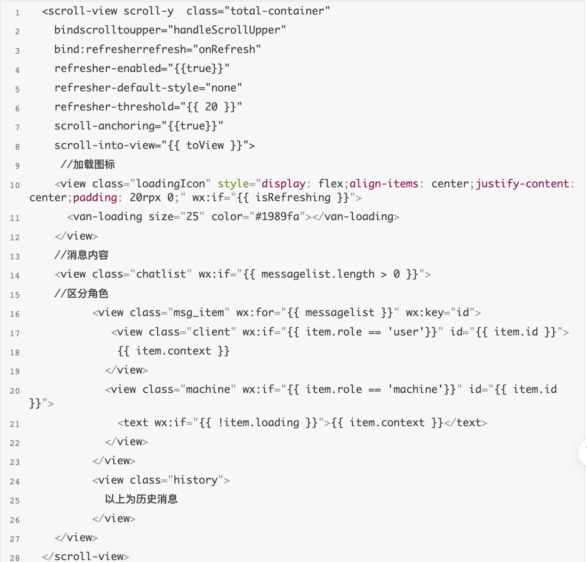

# wechat-scroll

微信小程序上拉加载历史消息修复闪烁问题

一、微信小程序上拉加载历史消息
最近使用微信小程序的 scroll-view 实现上拉获取历史消息，遇到了很多坑，自己也百度了很多，但是依旧没
有解决数据重新渲染后滚动条回到顶部的问题，我结合了 scroll-view 的 bindrefresherrefresh 和
bindscrolltoupper 和 scroll-into-view 来解决，体验感稍微提升了许多。

首先需要明白的一点是为什么会出现闪烁的问题，是因为微信小程序每次进行数据渲染的时候都会重绘页
面，导致滚动条回到顶部，在使用 scroll-into-view 回到指定位置，一上一下就会产生闪烁的效果。

